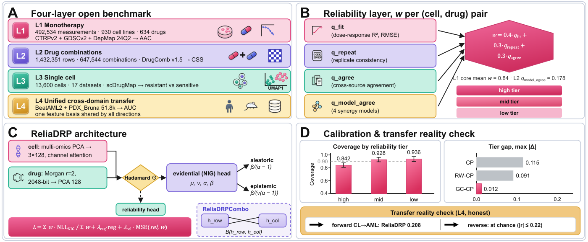

# ReliaDRP-Method

Code and data repository for:

> **ReliaDRP: Reliability-Aware Evidential Drug-Response Prediction with Distribution-Shift-Robust Calibration across a Four-Layer Open Benchmark**
> Lei Song, Juan Wang — ICASSP 2027 submission



*Figure 1 — ReliaDRP overview: (A) the four-layer open benchmark, (B) the reliability layer and the GC-CP calibration diagnosis.*

| Resource | Link |
|---|---|
| Paper (PDF) | [`ReliaDRP_ICASSP2027.pdf`](ReliaDRP_ICASSP2027.pdf) |
| Figure 1 | [`ReliaDRP_figure.pdf`](ReliaDRP_figure.pdf) · [`ReliaDRP_figure.png`](ReliaDRP_figure.png) |

## What this repository contains

A reliability-aware evidential regression framework (`ReliaDRP`) plus a four-layer open benchmark built entirely from public data:

| Layer | Task | Source | Protocol |
|---|---|---|---|
| **L1** | Monotherapy response | CTRPv2, GDSCv2, DepMap 24Q2 | in-domain / cold-cell / drug-blind |
| **L2** | Drug combinations | DrugComb v1.5 | in-domain / cold-cell / drug-blind |
| **L3** | Single-cell sensitivity | scDrugMap | in-domain / drug-blind |
| **L4** | Cross-domain transfer | pooled cell-line screens ↔ BeatAML2, Bruna PDX | 4 directions |

Every layer is evaluated with one harness against sixteen models (fifteen published baselines + an MLP). Two studies sit alongside the layers: **E1–E4** (conditional coverage, conformal recovery, uncertainty decoupling, uncertainty-based data selection) and **W1** (reliability-weight sensitivity).

## Repository layout

```
ReliaDRP-Method/
├── core/          6  model definitions, reliability construction, baseline zoo, validation guards
├── datasets/      8  dataset and split builders (L2 / L3 / extended panel / dose QC)
├── benchmark/     4  main harness (protocols, layer baselines, extended panel)
├── l1/            3  L1 monotherapy: screen / tune / seeded unified re-run
├── l2/            8  L2 combinations: unified harness + v3 screen/tune/confirm/ablation
├── l3/            6  L3 single-cell: benchmark + v3 screen/confirm + seeded sweep/unified
├── l4/            2  L4 cross-domain transfer (+ run_l4_all.sh grid driver)
├── calibration/   5  E1–E4 coverage/conformal/decoupling/data-selection + W1 sensitivity
├── reporting/    13  result summaries, ranks, LaTeX/Markdown table generation
├── data/             runtime data root (20.65 GB / 3021 files, git-ignored)
├── reliability/      reliability intermediates
└── ReliaDRP_ICASSP2027.pdf, ReliaDRP_figure.pdf, ReliaDRP_figure.png
```

## Data

`data/` is **not** tracked in git (20.65 GB). Download the archive from geogle drive (#https://drive.google.com/drive/folders/1ldUrNQ_OGDoGT_v5cpLlx-cimFfpUpnL?usp=drive_link), unpack it, and place it so that the tree resolves as:

```
data/
├── raw/             1.4G   DepMap omics: OmicsCNGene.csv, OmicsExpression*.csv,
│                            OmicsSomaticMutations*.csv, Model.csv
├── processed/       223M   response_long.csv, ctrpv2_response.csv, gdscv2_response.csv,
│                            drugs_*_feat.csv, gene_names.txt
├── processed_ext/   1.1G   extended-panel derived data (L2/, L3/, response_ext.csv)
├── _dose_profiles/  799M   Table5-8_*TruncatedDrugResponseProfiles.csv
├── _drugcomb/       1.4G   DrugComb combination data (L2 source)
├── _scdrugmap/       11G   scDrugMap single-cell data (L3 source)
├── _drevalpy/       5.6G   DrevalPy datasets (extended panel)
├── feat/             16M   cell / drug features, pathways, tissue, drug graph
├── splits/           12M   P0/P1/P2 split index arrays (.npy)
└── results/         131M   training outputs: models/, preds/
```

Two large intermediates are regenerable and not shipped (see [Regenerating intermediates](#regenerating-intermediates)).

## Requirements

Python 3.12.4 with PyTorch 2.5.1 (CPU or CUDA), NumPy, pandas, scikit-learn. Reference environment: `E:\anaconda\python.exe` on Windows.

**External code dependency.** Six modules pull shared model/loader code from a sibling `new_data/exp` directory (normally a junction to the parent DRP project):

```python
EXPCODE = os.path.normpath(os.path.join(HERE, "..", "new_data", "exp"))
```

That is `benchmark/run_benchmark.py`, `core/reliadrp.py`, `core/model_zoo_2021_2026.py`, and `calibration/run_e1/e2/e3_*.py`. When cloning elsewhere, either provide `new_data/exp` as a sibling of this repository or adjust `EXPCODE` in those six files.

## Running

Most scripts are path-independent and can be launched from any working directory:

```bash
# L1 — seeded unified re-run (source of paper Table 1)
python l1/run_l1_unified_seeded.py

# L2 — unified harness, one recipe for baselines and the proposed model (Table 2)
python l2/run_l2_unified.py

# L3 — unified seeded panel (Table 3) and the 12-configuration sweep
python l3/run_l3_unified_seeded.py
python l3/run_l3_seeded_sweep.py

# L4 — full grid: 16 models x 4 directions x 5 seeds = 320 runs (~8-9 h, resumable)
python l4/run_l4_transfer_unified.py
bash l4/run_l4_all.sh
```

`run_l4_all.sh` runs the grid seed-layer by seed-layer, so an interrupted run always leaves a *complete* uniform grid on disk; completed `(direction, model, seed)` cells are skipped on re-run.

### Path contract

Every script sits exactly one level below the repository root and resolves paths with

```python
HERE = os.path.dirname(os.path.dirname(os.path.abspath(__file__)))   # repository root
```

so `HERE/data`, `HERE/reliability` and `HERE/../new_data/exp` behave identically regardless of the caller's working directory. Cross-directory imports are made explicit with `sys.path.insert(0, os.path.join(HERE, "<dir>"))` — `core/` for model and reliability modules, and additionally `benchmark/` in the eleven scripts that reuse `run_benchmark.train_one` / `infer`. Same-directory imports (e.g. `l3/run_l3_v3_confirm.py` → `run_l3_v3_screen`) rely on Python putting the script's own directory on `sys.path[0]`.

### Output locations

All `run_*` scripts write their result CSV to the repository root by default (`--out` defaults to `HERE/<name>.csv`), e.g. `l1_unified_seeded.csv`, `l3_unified_seeded.csv`, `l2_unified.csv`, `l4_transfer_unified.csv`. These CSVs are the input to `reporting/` and the source of the paper's tables.

**Working directory exceptions** — a few scripts do not follow the contract above:

| Script | Behaviour |
|---|---|
| `reporting/_four_tables.py`, `_tables_tex.py`, `_pick_worst6.py`, `_apply_tables.py`, `_l1_ranks.py` | use bare relative paths (result CSVs, `paper/`); must be run from the results workspace |
| `benchmark/summarize_extended_benchmark.py`, `reporting/consolidate_tables.py` | hard-code the results workspace path |
| `reporting/_render_md_html.py` | takes paths from `argv` |

## Code map

### core/ — models and reliability

| File | Lines | Purpose |
|---|---:|---|
| `reliadrp.py` | 199 | `ReliaDRP` (single drug), `ReliaDRPCombo`, `ReliaDRPExpr`; `nig_nll_elem` |
| `reliadrp_v3.py` | 343 | v3 architecture: `ReliaDRPV3`, `ReliaDRPComboV3/V4`, `ReliaDRPExprV3`, `TokenMixer` |
| `reliability.py` | 151 | reliability score from dose-response fit quality and cross-source agreement |
| `reliability_v2.py` | 85 | reliability v2 — the version used in the paper |
| `guards.py` | 109 | mandatory validation guards (shuffled-label control, leakage, row-order invariance) |
| `model_zoo_2021_2026.py` | 301 | the sixteen-model zoo (`ALL_NAMES`) |

### datasets/ — data construction

| File | Lines | Purpose |
|---|---:|---|
| `build_dose_qc.py` | 102 | dose-response curve QC → `reliability/dose_qc.csv` |
| `build_extended_dataset.py` | 88 | extended-panel dataset → `data/processed_ext/` |
| `build_extended_features.py` | 108 | extended-panel features |
| `build_l2_dataset.py` | 157 | L2 combination dataset (DrugComb) |
| `build_l2_drugcomb_reliability.py` | 92 | reliability labels for combination data |
| `build_l3_dataset.py` | 120 | L3 single-cell dataset (scDrugMap) |
| `fix_l3_dataset.py` | 62 | L3 dataset repair (deterministic, seed 42) |
| `make_extended_splits.py` | 96 | extended-panel split indices |

### benchmark/ — main harness

| File | Lines | Purpose |
|---|---:|---|
| `run_benchmark.py` | 207 | main evaluation harness; exports `train_one` / `infer` / `q_conformal` / `picp_mpiw` / `ALPHA` |
| `run_layer_baselines.py` | 144 | per-layer baselines (`prep_l3` is reused by L3) |
| `run_extended_benchmark.py` | 115 | extended-panel benchmark |
| `summarize_extended_benchmark.py` | 34 | extended-panel summary |

### l1/ l2/ l3/ l4/ — the four layers

| File | Lines | Purpose |
|---|---:|---|
| `l1/run_l1_unified_seeded.py` | 281 | seeded unified re-run of the whole L1 panel (Table 1) |
| `l1/run_l1_v3_screen.py` | 90 | v3 fast screen (seed 0, selection by val RMSE) |
| `l1/run_l1_v3_tune.py` | 209 | v3 hyper-parameter tuning |
| `l2/run_l2_unified.py` | 261 | unified L2 harness — `MeanDrugAdapter` / `PairDrugAdapter` give baselines and the proposed model one recipe |
| `l2/run_l2_v3_confirm.py` | 184 | 5 seeds x 3 protocols confirmation (proposed row of Table 2) |
| `l2/run_l2_v3_ablation.py` | 280 | mean-drug ablation (the 0.077 / 0.028 / 0.004 gaps quoted in the paper) |
| `l2/run_l2_v3_screen.py` | 179 | v3 fast screen (seed 0, `L2_random` + `L2_LCO`) |
| `l2/run_l2_v3_tune.py` | 251 | v3 hyper-parameter tuning |
| `l2/run_l2_benchmark.py` | 215 | early L2 benchmark |
| `l2/run_l2_ablation.py` | 194 | L2 ablation (origin of MoGraphDRP's in-domain edge) |
| `l2/run_l2_reliadrpcombo.py` | 179 | early standalone combination run |
| `l3/run_l3_unified_seeded.py` | 261 | seeded unified L3 panel (Table 3) |
| `l3/run_l3_seeded_sweep.py` | 215 | seeded 12-configuration sweep (source of 0.727 ± 0.012) |
| `l3/run_l3_v3_screen.py` | 124 | v3 fast screen (seed 0, selection by val AUROC) |
| `l3/run_l3_v3_confirm.py` | 62 | 5-seed confirmation of the top two L3 variants |
| `l3/run_l3_benchmark.py` | 113 | early L3 benchmark |
| `l3/run_l3_reliadrp.py` | 110 | early single-cell expression model run |
| `l4/run_l4_transfer_unified.py` | 275 | unified transfer: cell lines ↔ BeatAML2 / PDX, 4 directions x 16 models x 5 seeds (Table 4) |
| `l4/run_l4_transfer.py` | 131 | earlier single-direction transfer |
| `l4/run_l4_all.sh` | — | full-grid driver (seed-layer ordered, resumable) |

### calibration/ — coverage and uncertainty

| File | Lines | Purpose |
|---|---:|---|
| `run_e1_conditional_coverage.py` | 118 | E1: coverage by reliability tier (source of the 0.115 tier gap) |
| `run_e2_conformal_recovery.py` | 141 | E2: CP / RW-CP / GC-CP comparison (GC-CP brings the gap to 0.012) |
| `run_e3_uncertainty_decoupling.py` | 126 | E3: uncertainty decoupling |
| `run_e4_data_selection.py` | 90 | E4: uncertainty-based data selection |
| `run_w1_sensitivity.py` | 333 | W1: reliability-weight sensitivity (post-hoc, no retraining) |

### reporting/ — tables and figures

| File | Lines | Purpose |
|---|---:|---|
| `_l1_seeded_report.py` | 233 | L1 seeded analysis (old vs new, with ranks) |
| `_l3_seeded_report.py` | 140 | L3 seeded analysis (old vs new, with ranks) |
| `_l1_ranks.py` | 82 | L1 mean ranks under several conventions |
| `_pick_worst6.py` | 60 | per-layer ranking of the sixteen models |
| `_four_tables.py` | 92 | emit the four layer tables |
| `_tables_tex.py` | 100 | build the four layer tables and splice them into the manuscript |
| `_apply_tables.py` | 222 | rebuild the tables as single-column floats and re-apply the prose |
| `_l1_apply_table.py` | 88 | regenerate the paper's L1 table body from the seeded CSV |
| `_all_layers_md.py` | 391 | consolidated four-layer results table (Markdown) |
| `_l2_chain_v3.py` | 88 | chained low-impact L2 v3 driver |
| `_render_md_html.py` | 74 | Markdown → standalone HTML |
| `consolidate_tables.py` | 61 | table consolidation |
| `_archived_run_l2_v4_confirm.py` | 150 | archived: L2 v4 confirmation (not in the paper) |

## Validation guard (mandatory)

Any **new or custom training loop** — i.e. anything that does not call `benchmark/run_benchmark.train_one` or `train_utils.train_model` — must pass the shuffled-label control before any OOD or classification metric is reported:

- Train the identical pipeline on **permuted training labels**, evaluate on the real test labels. AUROC must be ≈ 0.5 (< 0.60).
- A high shuffled control means the loop is broken. The failure mode observed twice in this project's history was indexing the full arrays with local batch positions instead of the global training rows `tr[perm]`; both corrections are documented in the paper (L2 and L3).

```python
from guards import shuffled_label_control, leakage_check
leakage_check(tr, te)
real, shuf = shuffled_label_control(run_with_labels, y[tr], name="my_loop")  # raises if >= 0.60
```

Also required for any new layer: **row-order invariance** (AUROC unchanged when test rows are permuted) and a **leakage check** (train/test index intersection = 0). Scripts that call `train_one` / `train_model` are exempt — they index `tr[...]` internally.

## Regenerating intermediates

Two large intermediates are deliberately not shipped. Rebuild them in order (a few minutes each):

```bash
python datasets/build_dose_qc.py --raw data   # -> reliability/dose_qc.csv          (237 MB)
python core/reliability.py                    # -> reliability/response_reliability.csv (66 MB)
python core/reliability_v2.py                 # -> reliability/response_reliability_v2.csv (54 MB, shipped)
```

- `build_dose_qc.py` requires **`--raw data` explicitly**: its default is `data/raw`, but `_dose_profiles` lives in `data/_dose_profiles`. The `--processed` / `--outdir` defaults are correct.
- Consumers: `benchmark/run_benchmark.py`, `calibration/run_e1..e4_*.py` and `calibration/run_w1_sensitivity.py` default `--rel` to `reliability/response_reliability.csv`; `core/reliability_v2.py` defaults `--dose-qc` to `reliability/dose_qc.csv`. If those files are absent, either rebuild them or point `--rel` / `--dose-qc` elsewhere.

## Citation

```bibtex
@inproceedings{song2027reliadrp,
  title     = {ReliaDRP: Reliability-Aware Evidential Drug-Response Prediction
               with Distribution-Shift-Robust Calibration across a Four-Layer Open Benchmark},
  author    = {Song, Lei and Wang, Juan},
  booktitle = {IEEE International Conference on Acoustics, Speech and Signal Processing (ICASSP)},
  year      = {2027}
}
```
